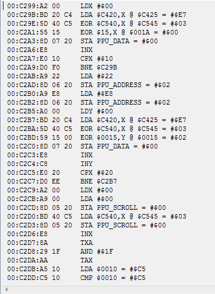
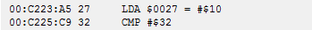

# HITB Amsterdam 2019

## Foreword

Last week is so crazy, i have a lot projects, exam, visa,...Although the process is not quite smooth but i still manage to get it all done anyway. And thanks @Unblvr for working together with me on solving this challenge.

## RE700 - NES

Challenge's description

```text
Welcome to the eighties, kid.
Back when computers still were interesting and relevant.
Don't you think multiple-GHz processors and GIGABYTES of RAM are boring?
Who on earth needs an MMU?
Arithmetic on multiple general purpose registers?
Pfftt..!
Anyway, grab a joypad and show us some speed running!
```

From challenge description and name, i can know that it's Nintendo Entertainment System \([https://en.wikipedia.org/wiki/Nintendo\_Entertainment\_System](https://en.wikipedia.org/wiki/Nintendo_Entertainment_System)\) which is basically application that running on 8-bit \( 😅 \) nintendo gaming machine.

I was used FCEUX debugger to debug this file. The challenge is quite trivial once you know how Sprite, Joypad input, A, X, Y register,... in 6052 works. So, I wont waste your time and move directly to where the program calculate flag :



Basically it's just 2 for loop xoring 0x20 bytes in \[C420\] and \[C540\] together with 0x10 bytes from \[15\] where \[15\] is our input. So we know that input key is 16 chars and output is 32 chars.


```python
arr_420 = [0x70, 0x75, 0x4e, 0x2c, 0x7f, 0xe7, 0x71, 0xe3, 0x60, 0x64, 0x30, 0x13, 0xe9, 0x24, 0xf2,   0x30, 0x72, 0x12, 0x67, 0x5d, 0x58, 0x96, 0x15, 0xd0, 0x02, 0x54, 0x1e, 0x32, 0x93, 0x51, 0xfb, 0x39]
arr_540 = [0x19, 0x13, 0x0f, 0x0a, 0x06, 0x03, 0x01, 0x00, 0x00, 0x00, 
0x02, 0x05, 0x08, 0x0c, 0x11,   0x16, 0x1b, 0x20, 0x25, 0x29, 0x2c, 0x2f, 0x31, 0x31, 0x31, 0x30, 0x2e, 0x2b, 0x27, 0x22, 0x1e, 0x19]
arr_15 = [0x40] * 0x10 #change this, this is our input, 16 bit key
for i in range(0, 0x20):
    print chr(arr_420[i] ^ arr_540[i] ^ arr_15[i%0x10])
```


So @Unblvr realize that the output must be printable so the input key must be the number that will make the char of output, separate to 2 lines, each have 16 chars, that in the same index in these two lines both printable \( Basically, we input input\[i\] that somehow must make flag\[i\] and flag\[i+16\] printable\) \(Dude realize that even before i gave him the code, pretty sure his IQ is 200+, no wonder why he kick ass all forensic challs\)


So we just brute force and have this results 

```text
[['0x8'], ['0x2', '0x4'], ['0x20'], ['0x10', '0x40'], ['0x40'], ['0x80'], ['0x40'], ['0x80'], ['0x1', '0x2', '0x4'], ['0x1', '0x2'], ['0x1', '0x2', '0x4'], ['0x20'], ['0x80'], ['0x10'], ['0x80'], ['0x10']]
```

Which mean we have 72 possible keys

$$
2  * 2 * 3 * 2 * 3 = 72
$$

I then realize there is some intermediate check



But @Unblvr was faster then me, he just try all 72 keys and found the right keys 😅 


And finally here is flag


