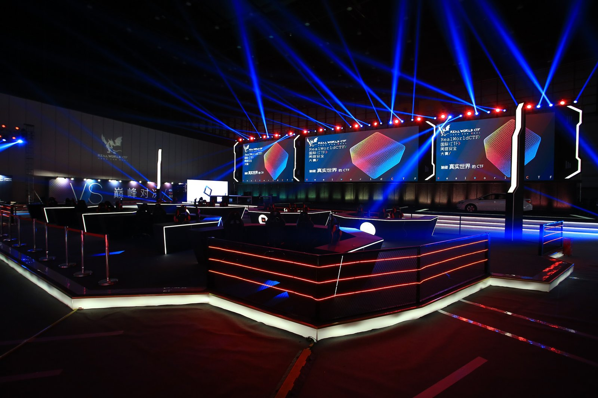

# Realworld CTF 2018 - Final

Lời đầu, mình xin được dành tặng những người đồng đội tuyệt vời đã cùng mình tham gia cuộc thi này. Cám ơn @auxy, @nearxxff, @drtychai, @fibonacci cũng như toàn thể thành viên @opentoall

Lời tiếp theo, mình xin phép cám ơn ban tổ chức \(Chaitin tech\) đã tổ chức cuộc thi tuyệt vời này, cám ơn Baidu vì bữa tiệc tuyệt vời, nhờ đó mình gặp những người bạn mới.

Lời cuối, cám ơn @stypr \(r3kapig\) vì giải thích web challs dễ hiểu và những câu chuyện \#thiphi \(hahahaha\)...Cám ơn @nneonneo \(PPP\) vì giải thích pwn challs dễ hiểu, bạn chắc chắn sẽ là một professor, một teacher tuyệt vời \(also goodlucks with your Assistants Professor job in 2019\)...Cám ơn @TokyoWestern vì giúp mình giải thích một số chỗ khó hiểu, các bạn là một đội rất mạnh và đoàn kết.

Okay, không dông dài nữa, bật headphone lên nghe nhạc và đọc thôi các bạng :3

[https://www.youtube.com/watch?v=Va0vs1fhhNI](https://www.youtube.com/watch?v=Va0vs1fhhNI)

## Ngày 1 \(30/12/2018\)

Mình tới sân bay Nội Bài, Hà Nội vào khoảng 10 giờ sáng. Đầu tiên mình vào làm thủ tục check-in tại quầy của China Southern Airline, bạn nhân viên khá xinh và dễ thương, thực ra quầy đó chỉ dành cho khách hạng Business, mình đi hạng Economy thì không có đặc quyền đó nhưng do quầy đó đang trống nên bạn ý gọi mình qua làm giúp luôn cho nhanh. Trước khi đi thì mình cũng rất lo lắng về vấn đề hành lý, quá cân rồi hoặc là xách 2 túi lên máy bay có làm sao không \(vì mình có vài "kỉ niệm" không được tốt lắm với Vietjet\), nhưng hóa ra bay quốc tế lại khá dễ dãi với vấn đề hành lý. Mình cũng khá bất ngờ với dịch vụ của hãng, trước khi bay mình có email hỏi về vấn đề lấy hành lý ra khi transit ở Guangzhou, hãng đã trả lời rất chu đáo, tuy nhiên khi mình ra tới quầy check-in thì hãng lại báo lại lần nữa. Vì tới tận 11h45 mới bay, nên mình phải ngồi chờ khoảng hơn nửa tiếng ở sân bay, trong lúc chờ cũng có mấy bạn nhân viên ra đưa cho Coca uống và xin lỗi vì phải để mình chờ \(mà thực ra do mình tới sớm mà :P\).

Lên máy bay, các bạn tiếp viên cũng khá dễ thương, nhất là giọng trung quốc con gái dễ thương cực :P Đáng nhẽ hãng này mình sẽ rate 10/10, nhưng vì một lý do nhỏ, **họ tưởng mình là người Trung Quốc** \(thực sự trong suốt chuyến đi đây là điều làm mình bối rối nhất...\) nên không có phát Arrival Card \(một cái thẻ màu vàng, khai báo thông tin của bạn và nộp lại cho cơ quan Nhập Cảnh khi bạn tới sân bay, chỉ chuyến bay quốc tế thôi nhé, nội địa không cần\). Vậy nên bạn nên chủ động hỏi họ trước khi máy bay hạ cánh, vì nhìn người Việt rất giống người Trung Quốc, ngoài ra, bạn cũng có thể lấy một tờ ở chỗ Nhập Cảnh, nhưng sẽ khá bất tiện.

Nhiều chữ quá, thêm vào vài tấm ảnh trên máy bay cho các bạn đọc đỡ ngán vậy :

Thời gian transit của mình ở Guangzhou là hơn 2 tiếng, tuy nhiên do ở chỗ Nhập Cảnh đứng xếp hàng đã mất hơn 1 tiếng rồi nên khi mình chạy tới quầy ra sân bay thì chỉ còn đúng 20 phút là máy bay cất cánh \(phew\). Có lẽ do mình khá may mắn, đáng lý ra là sẽ bị chậm rồi, nhưng máy bay tới sớm 10 phút, thêm vào đó chú cảnh sát ở chỗ Nhập Cảnh cũng không hỏi gì mình, thấy đưa visa ra cứ lẩm bẩm cái gì rồi cho qua luôn, cũng chả hỏi một câu nào...lý do tới cũng không hỏi luôn. Mình thấy mấy người đằng trước, có cả người Việt bị hỏi khá kỹ và mất khoảng tầm 5-10 phút mới được qua. Vậy nên nếu bạn có transit thì mình khuyên nên chọn các chuyến transit từ ít nhất 3 tiếng trở lên để không bị lỡ chuyến bay.

Trên máy bay...

Máy bay nội địa khá xịn, có cả sạc điện thoại, tuy nhiên chỉ sử dụng được khi máy bay chưa cất cánh

Do hành lý tới chậm, nên mình phải chờ gần 1 tiếng, nhân tiện cũng xin lỗi mấy bạn nữ ban tổ chức đã phải đợi mình. Mình có gặp đội CyKor lúc ở sân bay, họ cũng tới cùng lúc với mình,...tuy nhiên ban tổ chức lại xếp mình một xe riêng về khách sạn, không được ngồi cùng với họ...bỏ lỡ cơ hội làm quen với những người bạn mới.

