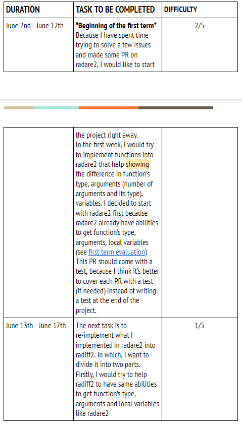

# Hướng Dẫn Viết Proposal Google Summer Of Code Đúng Chuẩn Người Chơi Hệ Phóng

## Mở Đầu

Đã khá lâu rồi mình không còn viết blog nữa vì nhiều lý do, trong đó có lẽ lý do lớn nhất là lười😂và có lẽ là cũng không có nhiều thứ để viết. Vì vậy nhân dịp đầu năm mới, mình cũng mong muốn có thể "khai bút" một chút, lấy lộc đầu năm, mong rằng năm sau có thể viết được nhiều bài và chất lượng hơn nữa. 

Series này lúc đầu mình tính viết 3 bài theo thứ tự từ trên xuống, bao gồm :

* Các tips trong việc lựa chọn Project và Mentor & Những thông tin cần chuẩn bị cho GSoC
* Hướng Dẫn Viết Proposal Google Summer Of Code
* Các câu lệnh git và công cụ sẽ giúp bạn sống sót qua một mùa Google Summer Of Code

Tuy nhiên nhìn lại thời điểm hôm nay mới là 12/01/2021, cũng tức là cách ngày nộp proposal chỉ còn khoảng 18 ngày \(30/01/2020 - Tuy nhiên sau khi viết xong bài này mình mới để ý là 30/01 là ngày nộp proposal của Organization cho Google thôi 😐 \). Cho nên đúng quy trình không bằng đúng thời điểm, mình viết luôn bài này để bạn nào apply GSoC năm nay đang bỡ ngỡ, chưa biết viết proposal thế nào có thể tham khảo.

Còn về phần tiêu đề tại sao lại là "đúng chuẩn người chơi hệ phóng" thì là vì mấy hôm gần đây mình khá là ngán ngẩm khi đọc một số proposal dài 18 trang và 28 trang 😑 nên mình viết bài này mong có thể hướng dẫn các bạn viết một proposal nhanh chóng, ngắn gọn, không lòng vòng và vào việc luôn như các dân tổ Hà Nội \(Ước chừng khoảng 8-10 trang, có một số bạn giỏi còn viết proposal ngắn nữa\) 



_Mỗi headline bên dưới \(ngoại trừ phần kết\) sẽ tương ứng một headline trong proposal. Và tên các headline cũng như một số phần mình sẽ để tiếng Anh cho dễ dù bài này viết bằng tiếng Việt, vì dù sao sau này lúc viết proposal cũng phải viết bằng tiếng Anh._

## About Me

Đây là phần để bạn giới thiệu bản thân với Mentor để hộ hiểu hơn về bạn, còn Google thì chắc lúc duyệt hồ sơ họ cũng không care lắm đâu 🤣 Thường thì phần này sẽ bao gồm những thông tin sau :

* Your name
* IRC, Telegram, Jabber name \(or similar\)
* GitHub name and URL \(or similar\)
* Email
* Blog address \(if exist/you want to share it\)
* CV link

Trong đó mục github và blog nếu bạn có contribute cho các project open-source hoặc hay viết blog đóng góp cho community thì mình nghĩ đây là một điểm cộng. Đây cũng là lý do mình vẫn khuyên anh em, bạn bè nên contribute cho các project open-source hoặc viết blog nhiều hơn, vì đơn giản cho đi là còn mãi và biết đâu lúc nào đó chúng ta lại có thể hái được trái ngọt từ những gì chúng ta vun trồng 😉

Còn CV link thì có thể sử dụng CV mà các bạn dùng để xin việc cũng được, không cần quá cầu kì.

## Abstract

Cái này nếu bạn nào đã viết khóa luận hoặc paper nghiên cứu khoa học rồi thì sẽ rất đơn giản, nó cũng giống như mục abstract của các paper, mô tả khái quát về vấn đề hoặc bài toán sẽ trình bày trong paper đó thôi. Tuy nhiên với nhiều bạn sinh viên thì có lẽ còn khá là mới mẻ với việc viết mục "Abstract" này, do đó bạn có thể sử dụng tip sau đây của mình "**Sử dụng lại chính phần Introduction của Project mà bạn apply**"

Thường các projects khi apply GSoC họ sẽ có một trang mô tả các ý tưởng họ muốn sinh viên thực hiện trong kì GSoC đó \(bởi họ cũng phải viết proposal xin Google duyệt mà 😁\). Ví dụ project "Radare2" thì sẽ có trang sau : [https://rada.re/gsoc/2020/ideas.html](https://rada.re/gsoc/2020/ideas.html#title_2)

Trong đó, nếu nhìn vào project "Type Analysis Improvements", bạn sẽ thấy có một đoạn intro nhỏ về project \(được đánh dấu ở ảnh dưới\), bạn hoàn toàn có thể "mượn" luôn đoạn intro này làm phần "Abstract" của mình, không vấn đề gì cả. Hơn nữa như thế sẽ đúng với mong muốn của mentor và mấy người maintain project đó luôn. Hoặc nếu thấy cần thiết có thể thêm thắt, chỉnh sửa một chút cũng được.

## Motivation

Phần này thì bạn chỉ cần trả lời 3 câu hỏi sau là đủ :

* **Why do you want to participate in GSoC this year, why us and why this task?**
* **Would you like to stay involved in the project after the GSoC done? If yes - please explain shortly why.**
* **If this task will be unavailable - would you like to take another one? If yes - please specify which one.**

Để mà nói viết phần này thì khó cũng không khó mà dễ cũng không dễ. Cái dễ ở đây là đây là mục bạn có thể "chém gió" được. Cái khó là làm sao cho họ thấy bạn humble và hiểu về project này, cũng như muốn contribute nhiều hơn cho nó, kể cả sau GSoC \(còn bạn có contribute tiếp sau GSoC hay không thì...không nằm trong phạm vi đề cập của bài viết này 😏\)

Mình xin phép lấy ví dụ với câu hỏi ****dưới đây

> **Would you like to stay involved in the project after the GSoC done? If yes - please explain shortly why.**

Với câu hỏi này thì có 2 ý chính mình nghĩ bạn muốn chỉ ra là

* Tại sao bạn sẽ tiếp tục contribute cho code base của Radare2?
* Bạn có thể đóng góp gì cho code base của Radare2 sau GSoC?

Với câu trả lời thứ nhất, bạn có thể liên hệ với việc bản thân đang làm thesis có liên quan trên trường, và rằng sẽ cần sử dụng các công cụ, framework open-source như Radare2 trong nghiên cứu của mình nên chắc chắn sẽ còn đóng góp cho nó. Còn với việc trả lời câu hỏi thứ hai cũng sẽ giúp bạn thể hiện được rằng bạn hiểu cái project/mảng ****này đến đâu. Bạn có thể tham khảo câu trả lời mẫu dưới đây.

> **I am currently researching algorithms/methods to do “Binary Diffing” for my bachelor thesis. And radare2 is a free, open-source and good experimental framework for me to go further and finish my thesis. That’s why I will keep contributing to radiff2 and radare2 even after GSoC. Also, if you look at the timeline, you will see that I can only implement some basic functionalities like calculating the Levenshtein distance between two functions represent in pseudo-code for pseudo-code diffing. However, we can do it better by doing diffing on the Abstract Syntax Tree \(see** [**diaphora's Pseudo-code fuzzy AST hash**](https://github.com/joxeankoret/diaphora/blob/44dfc7d31401f94764f1f62f2de626527c7fb29c/doc/heuristics.html#L55)**\). So it would be one of those things that I will do with radare2 after GSoC done.**

## **Specifications**

Phần này là một phần quan trọng khác, giúp team dev của Project dễ dàng hơn trong việc phân công mentor cho bạn, cũng như ngược lại.

Trong mục này thì bạn cần điền các thông tin như sau

* Location and timezone
* When you’ll need to start work and when - you can’t do this
* Where you’re going to track the status - is this just GitHub, or your personal blog, or any other option?
* Where are you going to discuss your task with mentors - using text chats, like IRC/Telegram/Slack/etc, or using real-time audio/video communication?
* How much time you’re going to invest in this task

Trong đó có 2 mục mình thấy cần chú ý là "Location and timezone" và "How much time you're going to invest in this task".

Về "Location and timezone" thì mình nghĩ đây là một trong những yếu tố hàng đầu cần xem xét khi lựa chọn Project và Mentor.  Chắc chắn bạn ở Việt Nam thì sẽ không muốn chọn một mentor ở Mỹ vì lúc họ đi ngủ là lúc bạn làm việc và ngược lại. Khác biệt quá lớn về mặt thời gian sẽ dẫn tới khá nhiều khó khăn trong việc trao đổi sau này. Cho nên mình khuyên nếu bạn ở VN thì tốt nhất nên chọn các mentor có timezone sát mình \(vd ở Trung Quốc\) thì sẽ dễ dàng hơn rất nhiều.

Còn về "How much time you're going to invest in this task" thì mình được lãnh tụ RD góp ý là nên để tầm 20-30 tiếng/tuần, tức là bằng thời gian của một công việc part-time thôi. Còn tất nhiên thực tế bạn phân bổ thời gian như nào hoàn toàn phụ thuộc vào bạn, miễn bạn hoàn thành đúng deadline là okay. Nhưng ghi vào proposal thì tầm 20-30 tiếng/tuần là hợp lý.

Ngoài ra có một tip nhỏ là khi trả lời "When you’ll need to start work and when - you can’t do this" thì bạn nên xin 4-7 ngày nghỉ phép để thi cuối kỳ vì đa phần các trường đại học ở Việt Nam thi cuối kỳ vào tháng 6, tháng 7 tức là khoảng cuối term 1 hoặc đầu term 2. Mình nghĩ là có nhiều bạn lúc viết proposal chắc sẽ không nghĩ tới vụ này 😂

## Major Goals

Đây là phần cực kì quan trọng, vì nó sẽ là cái mà sau này Google dựa vào để đánh giá công việc của bạn và để xem có cho bạn pass vòng "Evaluation" của họ hay không. Vì vậy bạn cần suy nghĩ kĩ và tính toán để viết phần này thật chính xác vì nếu bạn không hoàn thành các goal này sẽ bị coi là fail và không được làm tiếp nữa, cho dù mentor muốn cũng không cứu bạn được.

Vì "Evaluation" của GSoC được chia ra làm 3 đợt, nên major goals cũng sẽ chia làm 3 goal chính

* 1st term
* 2nd term
* 3rd term

Và vì mỗi term có thời hạn 1 tháng, nên bạn cần lựa chọn thật kĩ và chính xác bạn kì vọng sẽ hoàn thành cái gì trong 1 tháng này. Mình khuyên là nên hoàn thành mục **timeline** \(bên dưới\) trước rồi quay lại viết cái này, và khi làm timeline thì cũng nên để trống ra 3-4 ngày trước ngày "Evaluation" để phòng trường hợp task cần nhiều thời gian hơn dự kiến, bạn đi du lịch mùa covid và chẳng may bị dích,...cũng như để có đủ thời gian chuẩn bị cho cái proposal.

## Optional Goals

Phần này thì không quá quan trọng vì thực tế bạn chỉ cần hoàn thành đủ những gì trong mục **task** hoặc mục **Major Goals** bên trên ****là đã pass mấy cái evaluation rồi. Tuy nhiên mình nghĩ cái này bạn viết một chút thì sẽ thể hiện bạn humble với project này ra sao, bạn hiểu vấn đề tới đâu cũng như nếu hoàn thành xuất sắc, vượt chỉ tiêu thì còn có nhiều swag, quà,...và đi dự GSoC conference nữa

## Timeline

Thời gian biểu cũng là cái quan trọng, giúp mentor và chính bạn có thể nắm rõ được bạn sẽ làm gì, mất bao lâu. Riêng phần này mình khuyên các bạn nên kẻ bảng ra, cho nó dễ nhìn và dễ hiểu

Bảng này thì mình chia làm 3 cột như sau 

* **DURATION** \(thời gian dự kiến hoàn thành task\)
* **TASK TO BE COMPLETED** \(task dự kiến sẽ hoàn thành\)
* **DIFFICULTY** \(đánh giá độ khó\)

Thì tip ở đây là mình sẽ viết hết cột **TASK TO BE COMPLETED** ra trước. Sau đó dựa vào cột này mình sẽ đánh giá được độ khó của task và hoàn thành cột **DIFFICULTY**. Sau đó mình lại quay lại cột **DURATION** và phân bổ thời gian dựa trên độ khó của task.

Ví dụ task có độ khó 1/5 sẽ mất ít thời gian hơn task có độ khó 2/5

Một tip khác ở đây là mình sẽ cố gắng break cái **Major Goals** ra làm các tasks nhỏ nhất có thể. Thường thì nên break ra thành các tasks có thể hoàn thành trong tầm 3-4 ngày và tối đa là 7-10.

## Micro-Tasks and Contributions

Phần này thì mình khuyên là các bạn nên có 1-2 commits cho project khi viết proposal. Vì tay không bắt giặc thì khó lắm 🤣 Vì proposal hay profile bạn đẹp tới đâu mà không có gì thực tế chứng minh thì cũng hơi khó. Cụ thể như nào thì mình sẽ đề cập tới trong 2 bài còn lại của series sau

## GSoC experience

Phần này thì chắc những người ngồi đọc bài post này của mình đa phần đều là "tấm chiếu mới", nói chung mình nghĩ không quan trọng lắm. Nhưng mà anh em nào tham gia nhiều rồi thì nên lưu ý là hiện tại đang có một rule là một người không thể tham gia GSoC quá 2 lần vì có nhiều ông năm nào cũng tham gia kiếm cơm \(no judge\) 😂

## Lời Kết

Thực ra năm ngoái khi mình tham gia discord của GSoC thì khá buồn vì thấy ít người Việt tham gia chương trình này, mặc dù mình thấy nó rất hay. Trong discord cũng không có channel cho anh em Đông Lào luôn T-T

Nên là cũng tự nhủ sang mùa GSoC mới sẽ làm một bài như này để giới thiệu nhiều bạn sinh viên Việt Nam biết tới program này hơn. Mong rằng kì GSoC 2021 này sẽ gặp nhiều anh em Đông Lào hơn.

Anyway, chúc mừng năm mới, chúc các anh em và quý bạn đọc có một cái tết dương và kỳ nghỉ đông hạnh phúc bên gia đình và người thân. Cám ơn mọi người đã đọc bài, peace out!!!!



